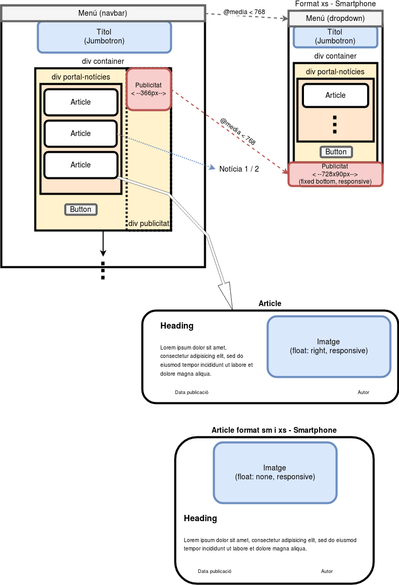

# LMSGI - Portal de notícies
## Plana de notícies autoemplenable (HTML, CSS, Bootstrap, JS, jQuery, JSON, RSS)

### [Notícies d'Avanç](https://rawgit.com/2aven/LMSGI_04-NdA/master/news.html)

Planificació:
1. [x] Diseny inicial de les pàgines i formats per pantalla o smartphone:
    - 
1. [x] Escructura base HTML de la plana principal.
    - [x] Espai reservat per publicitat:
    - - [x] Banner de 336x280 px per pantalles > 768px
    - - [x] Banner inferior fixe de 728x90px per pantalles menors
1. [x] Codi JS per carregar les notícies dels fitxers JSON
    - [x] Event Scroll Bottom
    - [x] Botó auxiliar de càrrega (que desapareix quan no queden notícies a mostrar)
1. [x] Format CSS a css/estil.css
    - [x] Ús de classes Bootstrap en el diseny
    - - [x] Menú de navegació plegable (desplaçar class="active" a cada pàgina)
    - - [x] Títol Jumbotron
    - - [x] Notícies dins contenidor
    - - [x] Separació d'articles per classe "row" per evitar apilament d'imatges
    - - [x] Format matges d'article i publicitat 'responsive'
    - - [x] Presentació de publicitat sidebar o footer administrat per formats de pantalla xs - sm - md - lg
    - [x] Paleta de color minimalista a partir de gradient blau i morat { #261D38, #375D81, #ABC8E2, #C4D7ED, #E5EBFF }
1. [x] Contingut de notícies
    - [x] Descripció de noticies a la pàgina de presentació.
    - [x] Notícia completa News1.html
    - [x] Notícia completa News2.html
    - [x] Descripció de notícies als fitxers JSON
    - [x] Imatges
    - - [x] (9) una per cada notícia al portal principal (mid)
    - - [x] (2) una per cada notícia completa (big)
    - - [x] imatges publicitàries
    - - [x] les imatges son de llicència lliure
1. [x] Reducció d'imatges per [Tinypng](https://tinypng.com/), estalviant un 58% de memòria.
1. [x] Arxiu RSS
    - [x] Incloure RSS al menú
    - [ ] Validació [RSS](https://validator.w3.org/feed/)
1. [x] Opcions meta OpenGraph
1. [x] Revisió ortogràfica i gramatical amb [SoftCatala](https://www.softcatala.org/corrector/).
   - [x] news.html
   - [x] news1.html
   - [x] news2.html
   - [x] 1.json
   - [x] 2.json
   - [x] rss.xml
1. [x] Validació amb [W3 Validator](https://validator.w3.org/): Recomana considerar elements h2-h6, però l'article ja inclou el respectiu títol <heading>. No es mostren errors.
